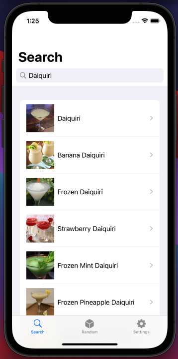
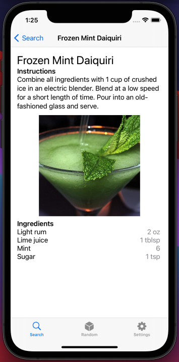
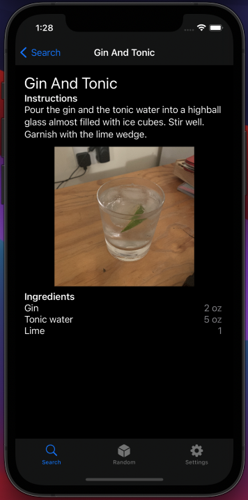

# cocktails-ios
A cocktail search engine for iOS, developed in Xcode v12 with SwiftUI. The backend data is obtained from API calls to [TheCocktailDB](https://www.thecocktaildb.com/)

The app allows you to search for your favourite cocktail and get back the ingredients, some instructions and a photo

## Views from iPhone 12 Simulator
  
